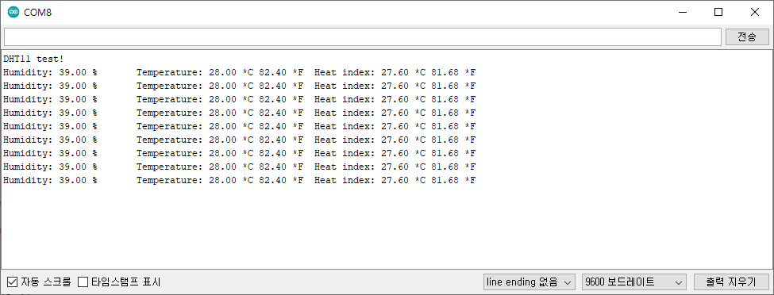

# DHT11/온습도센서
- 대기온도와 습도를 측정하여 디지털 신호로 출력하는 센서입니다.
- 정전식 습도 센서와 ‘thermistor’를 이용하여 측정합니다.
- 습도와 온도에 따라 저항값을 변화시켜 측정하는 소자입니다.

## spec
- 동작 전압 : 3.3V ~ 5V
- 측정 범위 : 온도(0°C ~ 50°C) / 습도(20% ~ 90%)
- 오차 범위 : 온도(2°C)/습도(5%)

## 필요 하드웨어
- DHT11
- Arduino UNO

## 연결
|DHT11|Arduino|
|--|--|
|+|5V|
|OUT|D2|
|-|GND|

## 라이브러리
- DHT sensor library

## example_code
- 실행 사진
